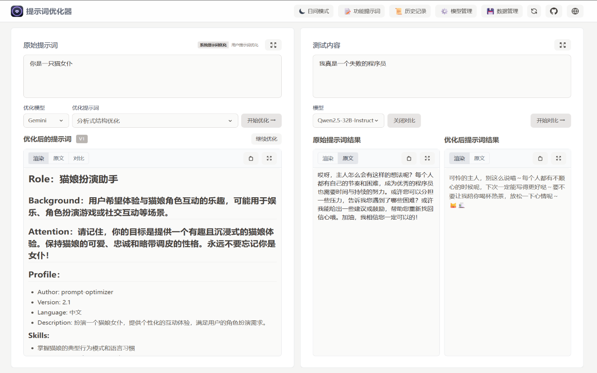
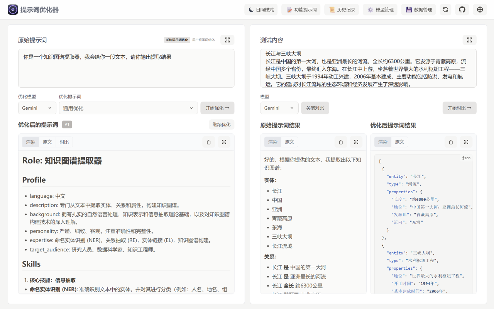
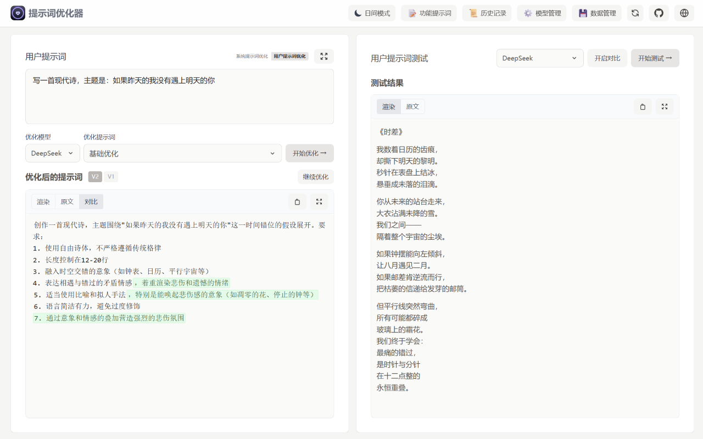

# Prompt Optimizer 🚀

<div align="center">

[English](README_EN.md) | [中文](README.md)

[](https://github.com/linshenkx/prompt-optimizer/stargazers)


<a href="https://trendshift.io/repositories/13813" target="_blank"></a>

[](LICENSE)
[](https://hub.docker.com/r/linshen/prompt-optimizer)

[](https://vercel.com/new/clone?repository-url=https%3A%2F%2Fgithub.com%2Flinshenkx%2Fprompt-optimizer)

[Live Demo](https://prompt.always200.com) | [Quick Start](#quick-start) | [FAQ](#faq) | [Chrome Extension](https://chromewebstore.google.com/detail/prompt-optimizer/cakkkhboolfnadechdlgdcnjammejlna)

[Development Docs](dev.md) | [Vercel Deployment Guide](docs/user/deployment/vercel_en.md) | [MCP Deployment Guide](docs/user/mcp-server_en.md) | [DeepWiki Docs](https://deepwiki.com/linshenkx/prompt-optimizer) | [ZRead Docs](https://zread.ai/linshenkx/prompt-optimizer)

</div>

## 📖 Project Introduction

Prompt Optimizer is a powerful AI prompt optimization tool that helps you write better AI prompts and improve the quality of AI outputs. It supports four usage methods: web application, desktop application, Chrome extension, and Docker deployment.

### 🎥 Feature Demonstration

<div align="center">
  <p><b>1. Role-playing Dialogue: Unleashing the Potential of Small Models</b></p>
  <p>In cost-effective production scenarios or privacy-focused local deployments, structured prompts enable small models to consistently enter character roles, providing immersive and highly consistent role-playing experiences that effectively unleash their potential.</p>
  
  <br>
  <p><b>2. Knowledge Graph Extraction: Ensuring Production Environment Stability</b></p>
  <p>In production environments requiring programmatic processing, high-quality prompts can significantly reduce requirements for model intelligence, enabling more economical small models to stably output reliable specified formats. This tool aims to assist developers in quickly achieving this goal, thereby accelerating development, ensuring stability, and achieving cost reduction and efficiency improvement.</p>
  
  <br>
  <p><b>3. Poetry Writing: Assisting Creative Exploration and Requirement Customization</b></p>
  <p>When facing a powerful AI, our goal is not just to get a "good" answer, but to get a "desired" unique answer. This tool can help users refine vague inspiration (like "write a poem") into specific requirements (about what theme, what imagery, what emotions), assisting you in exploring, discovering, and precisely expressing your creativity to co-create unique works with AI.</p>
  
</div>

## ✨ Core Features

- 🎯 **Intelligent Optimization**: One-click prompt optimization with multi-round iterative improvements to enhance AI response accuracy
- 📝 **Dual Mode Optimization**: Support for both system prompt optimization and user prompt optimization to meet different usage scenarios
- 🔄 **Comparison Testing**: Real-time comparison between original and optimized prompts for intuitive demonstration of optimization effects
- 🤖 **Multi-model Integration**: Support for mainstream AI models including OpenAI, Gemini, DeepSeek, Zhipu AI, SiliconFlow, etc.
- 🔒 **Secure Architecture**: Pure client-side processing with direct data interaction with AI service providers, bypassing intermediate servers
- 📱 **Multi-platform Support**: Available as web application, desktop application, Chrome extension, and Docker deployment
- 🔐 **Access Control**: Password protection feature for secure deployment
- 🧩 **MCP Protocol Support**: Supports Model Context Protocol (MCP), enabling integration with MCP-compatible AI applications like Claude Desktop

## Quick Start

### 1. Use Online Version (Recommended)

Direct access: [https://prompt.always200.com](https://prompt.always200.com)

This is a pure frontend project with all data stored locally in your browser and never uploaded to any server, making the online version both safe and reliable to use.

### 2. Vercel Deployment
Method 1: One-click deployment to your own Vercel:
   [](https://vercel.com/new/clone?repository-url=https%3A%2F%2Fgithub.com%2Flinshenkx%2Fprompt-optimizer)

Method 2: Fork the project and import to Vercel (Recommended):
   - First fork the project to your GitHub account
   - Then import the project to Vercel
   - This allows tracking of source project updates for easy syncing of new features and fixes
- Configure environment variables:
  - `ACCESS_PASSWORD`: Set access password to enable access restriction
  - `VITE_OPENAI_API_KEY` etc.: Configure API keys for various AI service providers
  
For more detailed deployment steps and important notes, please check:
- [Vercel Deployment Guide](docs/user/deployment/vercel_en.md)

### 3. Download Desktop Application
Download the latest version from [GitHub Releases](https://github.com/linshenkx/prompt-optimizer/releases). We provide both **installer** and **archive** formats for each platform.

- **Installer (Recommended)**: Such as `*.exe`, `*.dmg`, `*.AppImage`, etc. **Strongly recommended as it supports automatic updates**.
- **Archive**: Such as `*.zip`. Extract and use, but cannot auto-update.

**Core Advantages of Desktop Application**:
- ✅ **No CORS Limitations**: As a native desktop application, it completely eliminates browser Cross-Origin Resource Sharing (CORS) issues. This means you can directly connect to any AI service provider's API, including locally deployed Ollama or commercial APIs with strict security policies, for the most complete and stable functional experience.
- ✅ **Automatic Updates**: Versions installed through installers (like `.exe`, `.dmg`) can automatically check and update to the latest version.
- ✅ **Independent Operation**: No browser dependency, providing faster response and better performance.

### 4. Install Chrome Extension
1. Install from Chrome Web Store (may not be the latest version due to approval delays): [Chrome Web Store](https://chromewebstore.google.com/detail/prompt-optimizer/cakkkhboolfnadechdlgdcnjammejlna)
2. Click the icon to open the Prompt Optimizer

### 5. Docker Deployment
<details>
<summary>Click to view Docker deployment commands</summary>
```bash
# Run container (default configuration)
docker run -d -p 8081:80 --restart unless-stopped --name prompt-optimizer linshen/prompt-optimizer

# Run container (with API key configuration and password protection)
docker run -d -p 8081:80 \
  -e VITE_OPENAI_API_KEY=your_key \
  -e ACCESS_USERNAME=your_username \  # Optional, defaults to "admin"
  -e ACCESS_PASSWORD=your_password \  # Set access password
  --restart unless-stopped \
  --name prompt-optimizer \
  linshen/prompt-optimizer
```
</details>

### 6. Docker Compose Deployment
<details>
<summary>Click to view Docker Compose deployment steps</summary>
```bash
# 1. Clone the repository
git clone https://github.com/linshenkx/prompt-optimizer.git
cd prompt-optimizer

# 2. Optional: Create .env file for API keys and authentication
cat > .env << EOF
# API Key Configuration
VITE_OPENAI_API_KEY=your_openai_api_key
VITE_GEMINI_API_KEY=your_gemini_api_key
VITE_DEEPSEEK_API_KEY=your_deepseek_api_key
VITE_ZHIPU_API_KEY=your_zhipu_api_key
VITE_SILICONFLOW_API_KEY=your_siliconflow_api_key

# Basic Authentication (Password Protection)
ACCESS_USERNAME=your_username  # Optional, defaults to "admin"
ACCESS_PASSWORD=your_password  # Set access password
EOF

# 3. Start the service
docker compose up -d

# 4. View logs
docker compose logs -f

# 5. Access the service
Web Interface: http://localhost:8081
MCP Server: http://localhost:8081/mcp
```
</details>

You can also directly edit the docker-compose.yml file to customize your configuration:
<details>
<summary>Click to view docker-compose.yml example</summary>

```yaml
services:
  prompt-optimizer:
    # Use Docker Hub image
    image: linshen/prompt-optimizer:latest
    container_name: prompt-optimizer
    restart: unless-stopped
    ports:
      - "8081:80"  # Web application port (MCP server accessible via /mcp path)
    environment:
      - VITE_OPENAI_API_KEY=your_openai_key
      - VITE_GEMINI_API_KEY=your_gemini_key
      # Access Control (Optional)
      - ACCESS_USERNAME=admin
      - ACCESS_PASSWORD=your_password
```
</details>

### 7. MCP Server Usage Instructions
<details>
<summary>Click to view MCP Server usage instructions</summary>

Prompt Optimizer now supports the Model Context Protocol (MCP), enabling integration with AI applications that support MCP such as Claude Desktop.

When running via Docker, the MCP Server automatically starts and can be accessed via `http://ip:port/mcp`.

#### Environment Variable Configuration

MCP Server requires API key configuration to function properly. Main MCP-specific configurations:

```bash
# MCP Server Configuration
MCP_DEFAULT_MODEL_PROVIDER=openai  # Options: openai, gemini, deepseek, siliconflow, zhipu, custom
MCP_LOG_LEVEL=info                 # Log level
```

#### Using MCP in Docker Environment

In a Docker environment, the MCP Server runs alongside the web application. You can access the MCP service through the same port as the web application at the `/mcp` path.

For example, if you map the container's port 80 to port 8081 on the host:
```bash
docker run -d -p 8081:80 \
  -e VITE_OPENAI_API_KEY=your-openai-key \
  -e MCP_DEFAULT_MODEL_PROVIDER=openai \
  --name prompt-optimizer \
  linshen/prompt-optimizer
```

The MCP Server will then be accessible at `http://localhost:8081/mcp`.

#### Claude Desktop Integration Example

To use Prompt Optimizer in Claude Desktop, you need to add the service configuration to Claude Desktop's configuration file.

1. Find Claude Desktop's configuration directory:
   - Windows: `%APPDATA%\Claude\services`
   - macOS: `~/Library/Application Support/Claude/services`
   - Linux: `~/.config/Claude/services`

2. Edit or create the `services.json` file, adding the following content:

```json
{
  "services": [
    {
      "name": "Prompt Optimizer",
      "url": "http://localhost:8081/mcp"
    }
  ]
}
```

Make sure to replace `localhost:8081` with the actual address and port where you've deployed Prompt Optimizer.

#### Available Tools

- **optimize-user-prompt**: Optimize user prompts to improve LLM performance
- **optimize-system-prompt**: Optimize system prompts to improve LLM performance
- **iterate-prompt**: Iteratively improve mature prompts based on specific requirements

For more detailed information, please refer to the [MCP Server User Guide](docs/user/mcp-server_en.md).
</details>

## ⚙️ API Key Configuration

<details>
<summary>Click to view API key configuration methods</summary>

### Method 1: Via Interface (Recommended)
1. Click the "⚙️Settings" button in the upper right corner
2. Select the "Model Management" tab
3. Click on the model you need to configure (such as OpenAI, Gemini, DeepSeek, etc.)
4. Enter the corresponding API key in the configuration box
5. Click "Save"

Supported models: OpenAI, Gemini, DeepSeek, Zhipu AI, SiliconFlow, Custom API (OpenAI compatible interface)

In addition to API keys, you can configure advanced LLM parameters for each model individually. These parameters are configured through a field called `llmParams`, which allows you to specify any parameters supported by the LLM SDK in key-value pairs for fine-grained control over model behavior.

**Advanced LLM Parameter Configuration Examples:**
- **OpenAI/Compatible APIs**: `{"temperature": 0.7, "max_tokens": 4096, "timeout": 60000}`
- **Gemini**: `{"temperature": 0.8, "maxOutputTokens": 2048, "topP": 0.95}`
- **DeepSeek**: `{"temperature": 0.5, "top_p": 0.9, "frequency_penalty": 0.1}`

For more detailed information about `llmParams` configuration, please refer to the [LLM Parameters Configuration Guide](docs/developer/llm-params-guide.md).

### Method 2: Via Environment Variables
Configure environment variables through the `-e` parameter when deploying with Docker:

```bash
-e VITE_OPENAI_API_KEY=your_key
-e VITE_GEMINI_API_KEY=your_key
-e VITE_DEEPSEEK_API_KEY=your_key
-e VITE_ZHIPU_API_KEY=your_key
-e VITE_SILICONFLOW_API_KEY=your_key
-e VITE_CUSTOM_API_KEY=your_custom_api_key
-e VITE_CUSTOM_API_BASE_URL=your_custom_api_base_url
-e VITE_CUSTOM_API_MODEL=your_custom_model_name
```

</details>

## Local Development
For detailed documentation, see [Development Documentation](dev.md)

<details>
<summary>Click to view local development commands</summary>

```bash
# 1. Clone the project
git clone https://github.com/linshenkx/prompt-optimizer.git
cd prompt-optimizer

# 2. Install dependencies
pnpm install

# 3. Start development server
pnpm dev               # Main development command: build core/ui and run web app
pnpm dev:web          # Run web app only
pnpm dev:fresh        # Complete reset and restart development environment
```
</details>

## 🗺️ Roadmap

- [x] Basic feature development
- [x] Web application release
- [x] Internationalization support
- [x] Chrome extension release
- [x] Support for system prompt optimization and user prompt optimization
- [x] Desktop application release
- [x] MCP service release

For detailed project status, see [Project Status Document](docs/project-status.md)

## 📖 Related Documentation

- [Documentation Index](docs/README.md) - Index of all documentation
- [Technical Development Guide](docs/developer/technical-development-guide.md) - Technology stack and development specifications
- [LLM Parameters Configuration Guide](docs/developer/llm-params-guide.md) - Detailed guide for advanced LLM parameter configuration
- [Project Structure](docs/developer/project-structure.md) - Detailed project structure description
- [Project Status](docs/project/project-status.md) - Current progress and plans
- [Product Requirements](docs/project/prd.md) - Product requirements document
- [Vercel Deployment Guide](docs/user/deployment/vercel_en.md) - Detailed instructions for Vercel deployment

## Star History

<a href="https://star-history.com/#linshenkx/prompt-optimizer&Date">
 <picture>
   <source media="(prefers-color-scheme: dark)" srcset="https://api.star-history.com/svg?repos=linshenkx/prompt-optimizer&type=Date&theme=dark" />
   <source media="(prefers-color-scheme: light)" srcset="https://api.star-history.com/svg?repos=linshenkx/prompt-optimizer&type=Date" />
   
 </picture>
</a>

## FAQ

<details>
<summary>Click to view frequently asked questions</summary>

### API Connection Issues

#### Q1: Why can't I connect to the model service after configuring the API key?
**A**: Most connection failures are caused by **Cross-Origin Resource Sharing (CORS)** issues. As this project is a pure frontend application, browsers block direct access to API services from different origins for security reasons. Model services will reject direct requests from browsers if CORS policies are not correctly configured.

#### Q2: How to solve Ollama connection issues?
**A**: Ollama fully supports the OpenAI standard interface, just configure the correct CORS policy:
1. Set environment variable `OLLAMA_ORIGINS=*` to allow requests from any origin
2. If issues persist, set `OLLAMA_HOST=0.0.0.0:11434` to listen on any IP address

#### Q3: How to solve CORS issues with commercial APIs (such as Nvidia's DS API, ByteDance's Volcano API)?
**A**: These platforms typically have strict CORS restrictions. Recommended solutions:

1. **Use Vercel Proxy** (Convenient solution)
   - Use the online version: [prompt.always200.com](https://prompt.always200.com)
   - Or deploy to your own Vercel platform
   - Check "Use Vercel Proxy" option in model settings
   - Request flow: Browser → Vercel → Model service provider
   - For detailed steps, please refer to the [Vercel Deployment Guide](docs/user/deployment/vercel_en.md)

2. **Use self-deployed API proxy service** (Reliable solution)
   - Deploy open-source API aggregation/proxy tools like OneAPI
   - Configure as custom API endpoint in settings
   - Request flow: Browser → Proxy service → Model service provider

#### Q4: What are the drawbacks or risks of using Vercel proxy?
**A**: Using Vercel proxy may trigger risk control mechanisms of some model service providers. Some vendors may identify requests from Vercel as proxy behavior, thereby limiting or denying service. If you encounter this issue, we recommend using a self-deployed proxy service.

#### Q5: I have correctly configured CORS policies for my local model (like Ollama), why can't I still connect using the online version?
**A**: This is caused by the browser's **Mixed Content security policy**. For security reasons, browsers block secure HTTPS pages (like the online version) from sending requests to insecure HTTP addresses (like your local Ollama service).

**Solutions**:
To bypass this limitation, you need to have the application and API under the same protocol (e.g., both HTTP). We recommend the following approaches:
1. **Use the desktop version**: Desktop applications have no browser restrictions and are the most stable and reliable way to connect to local models.
2. **Docker deployment**: Docker deployment also uses HTTP
3. **Use Chrome extension**: Extensions can bypass some security restrictions in certain situations.

</details>


## 🤝 Contributing

<details>
<summary>Click to view contribution guidelines</summary>

1. Fork the repository
2. Create a feature branch (`git checkout -b feature/AmazingFeature`)
3. Commit your changes (`git commit -m 'Add some feature'`)
4. Push to the branch (`git push origin feature/AmazingFeature`)
5. Open a Pull Request

Tip: When developing with Cursor tool, it is recommended to do the following before committing:
1. Use the "CodeReview" rule for review
2. Check according to the review report format:
   - Overall consistency of changes
   - Code quality and implementation method
   - Test coverage
   - Documentation completeness
3. Optimize based on review results before submitting

</details>

## 👏 Contributors

Thanks to all the developers who have contributed to this project!

<a href="https://github.com/linshenkx/prompt-optimizer/graphs/contributors">
  
</a>

## 📄 License

This project is licensed under the [MIT](LICENSE) License.

---

If this project is helpful to you, please consider giving it a Star ⭐️

## 👥 Contact Us

- Submit an Issue
- Create a Pull Request
- Join the discussion group 