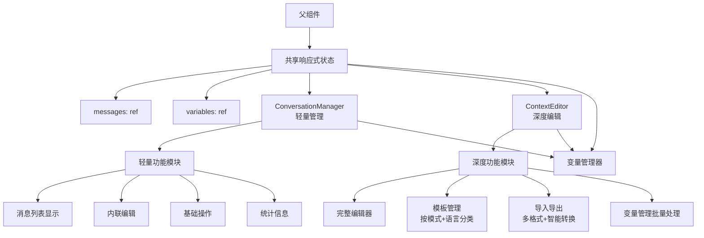

# 上下文编辑器重构 - 设计文档

## 概览

本设计文档定义了基于"主面板轻量管理 + 全屏编辑器深度管理"分工模式的上下文编辑器架构重构的技术实现方案。重构将移除ConversationMessageEditor和ConversationSection组件，简化ConversationManager为轻量级管理界面，增强ContextEditor为全功能编辑器，并实现两者间的双向数据绑定。

## 指导原则对齐

### 技术标准
- **Vue 3 Composition API**：使用组合式API和响应式系统
- **Naive UI组件库**：遵循现有的Pure Naive UI设计原则  
- **TypeScript类型系统**：严格的类型定义和接口规范
- **单一职责原则**：每个组件专注特定功能域

### 项目结构
- **组件模块化**：组件放置在`packages/ui/src/components/`目录
- **类型集中管理**：类型定义在`packages/ui/src/types/components.ts`
- **工具函数分离**：可复用逻辑抽取为composables

## 代码重用分析

### 需要保留的现有组件
- **ContextEditor.vue**：保持现有架构，增加模板和导入导出功能
- **ConversationManager.vue**：简化现有实现，移除复杂功能
- **相关composables**：`useResponsive`、`usePerformanceMonitor`、`useAccessibility`

### 需要移除的组件（重构完成后）
- **ConversationMessageEditor.vue**：功能整合到ConversationManager内联编辑
- **ConversationSection.vue**：过度抽象，功能合并到使用方

### 需要从backup组件移植的功能
- **模板管理功能**：从ConversationManager.vue.backup移植到ContextEditor，按优化模式与语言分类
- **导入导出功能**：从ConversationManager.vue.backup移植到ContextEditor，支持多格式与智能转换  
- **智能格式转换**：OpenAI、LangFuse、Conversation、Smart等格式支持

### 集成点
- **变量系统**：与现有变量管理器的事件通信
- **响应式系统**：Vue的reactivity API实现数据双向绑定
- **主题系统**：继承现有Naive UI主题配置

## 架构设计

### 模块化设计原则
- **单文件职责**：ConversationManager专注轻量管理，ContextEditor专注深度编辑
- **组件隔离**：两个组件通过共享父级ref松耦合通信
- **服务层分离**：数据操作、业务逻辑和展示层清晰分离
- **工具模块化**：变量扫描、模板处理等抽取为独立工具函数

### 数据绑定架构图



## 组件和接口

### ConversationManager（重构后）

#### 核心功能
- **紧凑消息列表显示**：内联编辑界面，适合主面板有限空间
- **内联消息编辑**：角色选择+文本输入，集成ConversationMessageEditor的基础编辑功能
- **基础操作**：添加、删除、重新排序消息
- **统计信息显示**：消息数、变量数、缺失变量数统计
- **变量管理集成**：统计与缺失提示、快速创建/打开变量管理器事件
- **折叠功能**：节省空间
- **打开ContextEditor入口**：访问高级功能

#### 移除功能
- 快速模板下拉菜单 → 移至ContextEditor
- 导入导出按钮 → 移至ContextEditor
- 同步到测试功能 → 已废弃

### ContextEditor（增强后）

#### 保持功能
- **标签页架构**：消息编辑/工具管理标签页
- **完整编辑功能**：支持完整编辑、预览与变量高亮/替换
- **可访问性支持**：保持现有的无障碍功能

#### 新增功能
- **模板选择/预览/应用**：按优化模式（system/user）与语言分类的模板管理
- **导入导出功能**：多格式支持、校验+净化、错误提示
- **智能转换**：支持OpenAI、LangFuse、Conversation、Smart等格式的智能识别转换
- **批量变量处理**：校验与替换，与Manager共用变量函数

### 数据同步机制

#### 双向绑定实现
- **共享数据源**：Manager与Editor操作同一份父级ref（messages, variables）
- **v-model同步**：通过Vue的响应式系统实现自动同步
- **实时反映**：在任一组件修改，另一组件即时反映变化
- **无需保存**：Editor关闭时无需额外保存步骤，所有修改实时生效

#### 变量管理集成
- **Manager职责**：统计与缺失提示、快速创建变量、打开变量管理器
- **Editor职责**：批量处理、深度编辑、校验与替换
- **共享函数**：两组件共用变量函数（scanVariables/replaceVariables/isPredefinedVariable）

## 数据模型与API设计

### ConversationManager Props
```typescript
interface ConversationManagerProps extends BaseComponentProps {
  // 双向绑定数据（直接操作父级ref）
  messages: ConversationMessage[]
  availableVariables?: Record<string, string>
  
  // 功能函数（提供默认实现）
  scanVariables?: (content: string) => string[] // 默认返回空数组
  replaceVariables?: (content: string, variables?: Record<string, string>) => string // 默认透传内容
  isPredefinedVariable?: (name: string) => boolean // 默认返回false
  
  // UI控制
  title?: string
  readonly?: boolean
  collapsible?: boolean
  showVariablePreview?: boolean
  toolCount?: number
  maxHeight?: number // 限制为number类型，内部拼接px
}
```

### ConversationManager Emits
```typescript
interface ConversationManagerEvents extends BaseComponentEvents {
  // 数据更新（v-model双向绑定）
  'update:messages': (messages: ConversationMessage[]) => void
  
  // 操作事件  
  messageChange: (index: number, message: ConversationMessage, action: 'add' | 'update' | 'delete') => void
  messageReorder: (fromIndex: number, toIndex: number) => void
  
  // 导航事件
  openContextEditor: () => void
  createVariable: (name: string) => void
  openVariableManager: (variableName?: string) => void
}
```

### ContextEditor Props（现有基础上新增）
```typescript
interface ContextEditorProps extends BaseComponentProps {
  // 现有属性
  visible: boolean
  state?: ContextEditorState
  showToolManager?: boolean
  
  // 双向绑定数据
  messages: ConversationMessage[]
  variables: Record<string, string>
  
  // 新增功能控制
  optimizationMode?: 'system' | 'user' // 用于模板筛选
  enableTemplateManager?: boolean
  enableImportExport?: boolean
  
  // 透传函数（与ConversationManager共享）
  scanVariables?: (content: string) => string[]
  replaceVariables?: (content: string, variables?: Record<string, string>) => string
  isPredefinedVariable?: (name: string) => boolean
}
```

### ContextEditor Emits（保持现有）
```typescript
interface ContextEditorEvents extends BaseComponentEvents {
  // UI状态
  'update:visible': (visible: boolean) => void
  'update:state': (state: ContextEditorState) => void
  
  // 操作事件
  save: (context: { messages: ConversationMessage[]; variables: Record<string, string> }) => void
  cancel: () => void
  
  // 变量管理
  openVariableManager: (variableName?: string) => void
  createVariable: (name: string, defaultValue?: string) => void
}
```

## 具体实现策略

### 阶段1：ConversationManager简化重构
1. **简化UI界面**：移除模板、导入导出、同步功能的UI元素
2. **集成内联编辑**：将ConversationMessageEditor的基础编辑功能整合为内联编辑
3. **优化数据绑定**：改为直接操作父级ref，实现v-model双向绑定
4. **更新API接口**：按照新的Props和Events规范重构
5. **功能函数默认值**：为scanVariables等函数提供默认实现
6. **参考现有实现**：利用ConversationMessageEditor.vue的编辑逻辑

### 阶段2：ContextEditor功能增强  
1. **模板管理集成**：
   - 添加模板选择标签页或功能区域
   - 按optimizationMode和语言分类显示模板
   - 实现模板预览和应用功能
   - 从ConversationManager.vue.backup移植相关逻辑

2. **导入导出功能**：
   - 在底部操作栏添加导入导出入口
   - 实现多格式支持（JSON、CSV、TXT等）
   - 添加数据校验和净化功能
   - 提供友好的错误提示

3. **智能格式转换**：
   - 支持OpenAI API格式
   - 支持LangFuse追踪格式
   - 支持标准Conversation格式
   - 实现Smart智能识别模式

4. **数据绑定对齐**：确保与ConversationManager的双向数据同步

### 阶段3：数据绑定层实现
1. **共享状态设计**：在父组件中创建响应式的messages和variables
2. **v-model实现**：两个子组件通过v-model与父组件数据绑定
3. **实时同步验证**：确保任一组件的修改都能实时反映到另一组件
4. **变量函数共享**：确保scanVariables、replaceVariables等函数在两组件中行为一致
5. **性能优化**：使用Vue的浅层响应式优化大数据渲染

### 阶段4：废弃组件清理
1. **功能验证**：全面测试新架构下的所有功能
2. **组件移除**：删除ConversationMessageEditor.vue和ConversationSection.vue
3. **引用清理**：更新所有导入和使用这些组件的地方
4. **类型定义更新**：更新types/components.ts中的相关接口
5. **最终测试**：进行完整的回归测试

**重要说明**：整个开发过程中，废弃的组件将保留作为参考，确保所有功能都能正确迁移。只有在验证所有功能都正常工作后，才在最后阶段进行组件清理。

## 事件命名约定

### 模板中的事件绑定
```vue
<template>
  <!-- kebab-case用于模板 -->
  <ConversationManager 
    @open-context-editor="handleOpenEditor"
    @create-variable="handleCreateVariable"
    @open-variable-manager="handleOpenVariableManager"
  />
</template>
```

### TypeScript类型定义
```typescript
// camelCase用于类型定义
interface ConversationManagerEvents {
  openContextEditor: () => void
  createVariable: (name: string) => void
  openVariableManager: (variableName?: string) => void
}
```

## 错误处理增强

### 导入数据处理
1. **格式校验**：严格验证导入数据的结构和类型
2. **数据净化**：清理潜在的恶意内容和无效字段
3. **错误提示**：提供具体的错误信息和修复建议
4. **回滚机制**：导入失败时保持原有数据不变

### 变量处理异常
1. **扫描异常**：变量扫描失败时降级到基础文本显示
2. **替换异常**：变量替换失败时保持原始占位符
3. **循环引用检测**：防止变量替换中的无限循环
4. **性能保护**：限制变量扫描的复杂度和时间

## 测试策略

### 单元测试重点
- ConversationManager内联编辑功能
- ContextEditor模板管理和导入导出功能  
- 双向数据绑定的同步逻辑
- 变量函数的默认实现和共享逻辑
- 智能格式转换的准确性

### 集成测试重点
- Manager与Editor的实时数据同步
- 模板应用对数据的影响
- 导入导出的完整工作流
- 变量管理的跨组件协作

### 端到端测试场景
- 轻量管理到深度编辑的用户流程
- 复杂模板的选择和应用
- 多格式数据的导入导出和转换
- 大量变量的创建和管理

## 性能考虑

### 渲染优化
- 使用shallowRef优化大量消息的响应式性能
- 模板和导入导出功能的懒加载
- 虚拟滚动支持（如需要）

### 内存管理
- 及时清理废弃组件的引用
- 优化双向绑定的响应式监听
- 避免循环引用导致的内存泄漏

### 用户体验
- 保持60fps的流畅交互
- 数据同步的实时响应
- 大数据导入的分批处理和进度提示