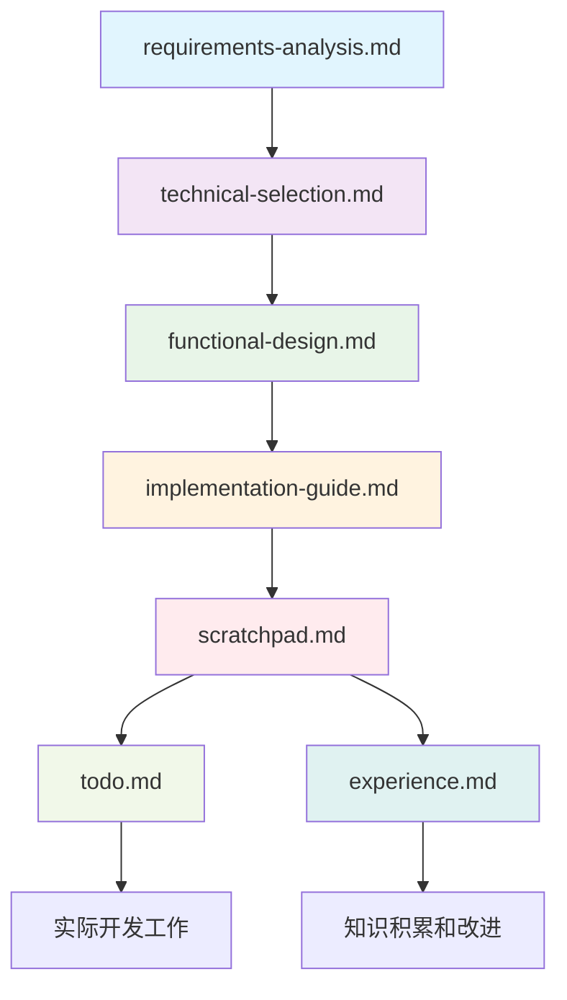

# UI库迁移至Naive UI项目 - 文档导航

**项目概述**: 将Prompt Optimizer的自建主题系统迁移到现代化的Naive UI组件库  
**创建日期**: 2025-01-01  
**项目状态**: 规划完成，准备实施  

## 📁 文档体系结构

### 🎯 核心工作区文档
这些是项目执行过程中的核心文档，需要持续更新和维护：

| 文档名称 | 用途 | 更新频率 |
|---------|------|----------|
| [scratchpad.md](./scratchpad.md) | 项目主控文档，记录实施进展和问题 | 每日更新 |
| [todo.md](./todo.md) | 详细任务清单和进度跟踪 | 每日更新 |
| [experience.md](./experience.md) | 技术经验和最佳实践记录 | 实时记录 |

### 📋 专业分析文档
这些是项目规划阶段的核心分析文档，为实施提供依据：

| 文档名称 | 用途 | 状态 |
|---------|------|------|
| [requirements-analysis.md](./requirements-analysis.md) | 需求分析和验收标准定义 | ✅ 已完成 |
| [technical-selection.md](./technical-selection.md) | 技术选型过程和决策依据 | ✅ 已完成 |
| [functional-design.md](./functional-design.md) | 功能设计和组件架构规划 | ✅ 已完成 |
| [implementation-guide.md](./implementation-guide.md) | 详细实施步骤和操作指南 | ✅ 已完成 |

## 🔗 文档关联关系

### 文档依赖关系说明

1. **需求分析** → **技术选型**: 基于需求确定技术方案
2. **技术选型** → **功能设计**: 基于选定技术设计实现方案
3. **功能设计** → **实施指南**: 将设计转化为具体操作步骤
4. **实施指南** → **工作区文档**: 指导实际开发工作
5. **工作区文档** → **知识循环**: 经验反馈到后续决策

## 📊 项目关键信息摘要

### 项目决策总结
| 决策项 | 结果 | 依据文档 |
|--------|------|----------|
| **目标UI库** | Naive UI | [technical-selection.md](./technical-selection.md) |
| **实施策略** | 三阶段渐进式迁移 | [implementation-guide.md](./implementation-guide.md) |
| **时间计划** | 4周 (2025-01-02 ~ 2025-01-29) | [todo.md](./todo.md) |
| **成功标准** | CSS减少60%，功能100%保留 | [requirements-analysis.md](./requirements-analysis.md) |

### 技术栈信息
- **当前技术栈**: Vue 3 + TypeScript + TailwindCSS + 自建主题系统
- **目标技术栈**: Vue 3 + TypeScript + TailwindCSS + Naive UI
- **主要变化**: 替换2600+行自定义CSS为现代化组件库
- **兼容保证**: 5种主题变体 + 国际化支持 + 响应式设计

## 🎯 快速开始指南

### 为新加入的开发者
如果您是新加入这个迁移项目的开发者，建议按以下顺序阅读文档：

1. **了解项目背景** 📋
   - 阅读 [requirements-analysis.md](./requirements-analysis.md) 了解项目需求和目标

2. **理解技术决策** 🔧  
   - 阅读 [technical-selection.md](./technical-selection.md) 了解为什么选择Naive UI

3. **掌握设计方案** 🎨
   - 阅读 [functional-design.md](./functional-design.md) 了解组件设计和架构

4. **开始实际工作** 🚀
   - 阅读 [implementation-guide.md](./implementation-guide.md) 了解详细实施步骤
   - 查看 [todo.md](./todo.md) 了解当前任务状态
   - 参考 [experience.md](./experience.md) 避免已知问题

5. **日常工作流程** 💼
   - 每日更新 [scratchpad.md](./scratchpad.md) 记录进展
   - 更新 [todo.md](./todo.md) 任务状态
   - 及时记录经验到 [experience.md](./experience.md)

### 为项目管理者
如果您需要了解项目进展和风险控制：

1. **项目概况**: 查看 [scratchpad.md](./scratchpad.md) 了解整体进展
2. **任务进度**: 查看 [todo.md](./todo.md) 了解具体任务完成情况  
3. **风险控制**: 查看 [implementation-guide.md](./implementation-guide.md) 的应急预案部分
4. **质量保证**: 查看各文档中的验收标准和测试计划

## 🔄 文档维护规范

### 更新频率要求
- **scratchpad.md**: 每日更新进展记录
- **todo.md**: 实时更新任务状态
- **experience.md**: 遇到重要经验时立即记录
- **其他文档**: 发生重大变更时更新

### 文档格式规范
- **标题**: 使用标准的Markdown标题格式
- **日期**: 统一使用 YYYY-MM-DD 格式
- **状态标识**: 使用 ✅❌⏳ 等emoji标识状态
- **代码示例**: 使用正确的语法高亮标记

### 版本控制
- 所有文档修改都需要提交到版本控制
- 重要修改需要在commit message中说明
- 定期创建文档快照备份

## 📈 项目里程碑跟踪

### 关键时间节点
- **2025-01-01**: ✅ 项目规划和文档创建完成
- **2025-01-02**: ⏳ 开始阶段1实施
- **2025-01-08**: ⏸️ 阶段1验收
- **2025-01-22**: ⏸️ 阶段2验收  
- **2025-01-29**: ⏸️ 项目最终验收

### 风险监控指标
- **进度风险**: 对照 [todo.md](./todo.md) 中的时间计划
- **质量风险**: 参考 [requirements-analysis.md](./requirements-analysis.md) 中的验收标准
- **技术风险**: 关注 [experience.md](./experience.md) 中记录的问题和解决方案

## 🆘 支持和帮助

### 常见问题
1. **Q**: 如何开始参与这个项目？  
   **A**: 先阅读本README，然后按照"快速开始指南"的顺序阅读相关文档。

2. **Q**: 遇到技术问题怎么办？  
   **A**: 先查看 [experience.md](./experience.md) 中的避坑指南，如果没有找到答案，记录问题到 [scratchpad.md](./scratchpad.md) 中。

3. **Q**: 如何报告问题或建议？  
   **A**: 在相关文档中记录，或者更新 [todo.md](./todo.md) 中的任务清单。

### 紧急情况处理
- **回退流程**: 参考 [implementation-guide.md](./implementation-guide.md) 中的应急预案
- **技术支持**: 查看 [experience.md](./experience.md) 中的故障排除指南
- **进度延期**: 参考 [todo.md](./todo.md) 调整任务优先级

## 📋 文档验证清单

在使用这些文档之前，请确认以下各项：

### 文档完整性检查
- [x] 所有计划文档都已创建
- [x] 文档间的引用关系正确
- [x] 关键信息在各文档间保持一致
- [x] 所有代码示例语法正确

### 文档可用性检查  
- [x] 新开发者能够通过文档快速上手
- [x] 项目管理者能够通过文档了解进展
- [x] 技术决策有充分的文档支撑
- [x] 实施步骤具体可操作

### 文档维护性检查
- [x] 文档结构清晰，易于更新
- [x] 关键信息集中，避免重复
- [x] 版本控制和更新机制明确
- [x] 文档格式规范统一

---

**文档体系状态**: ✅ 已完成  
**最后验证日期**: 2025-01-01  
**下一步**: 开始项目实施，按计划更新工作区文档

**联系信息**: 开发团队负责维护和更新